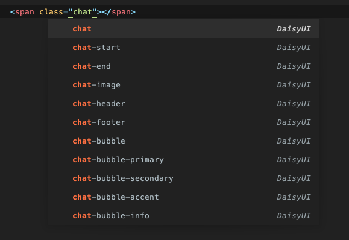

# daisyui-autocomplete by [etoundi.com](https://www.etoundi.com/)

[DaisyUI](https://github.com/saadeghi/daisyui) `v.3.2.1` autocomplete for Sublime Text.



### Installation
```bash
# add the repository to the Sublime packages directory
cd ~/Library/Application\ Support/Sublime\ Text/Packages/
git clone git@github.com/etoundi2nd/daisyui-autocomplete.git
```

### Contribution
```bash
# if you want to contribute to the project,
# creating a symlink to a directory of your choice might be helpful
ln -s ~/Library/Application\ Support/Sublime\ Text/Packages/daisyui-autocomplete ~/Documents/my-projects/daisyui-autocomplete
```

Note: you can get the Sublime packages path in the Sublime menu:
`Sublime Text > Preferences > Browse Packages…`

Note: getting a list of daisyui using ruby

#### Parse full css output (will includes all TailwindCSS classes)
```ruby
# install gem
gem install css_parser

# then in irb
require 'css_parser'
include CssParser

url = 'https://cdn.jsdelivr.net/npm/daisyui@3.2.1/dist/full.css' # change version to the latest
parser = CssParser::Parser.new
parser.load_uri!(url)

classes_list = parser.to_h['all'].keys.filter_map do |key|
    next unless key.starts_with?('.')
    key.split(' ')[0]
       .split(':')[0]
       .strip
       .split('[')[0]
       .gsub('\\', '')
       .split('.')
       .reject(&:empty?)
end.flatten.uniq

puts classes_list
```

#### Web scrapping the documentation

```ruby
gem install 'nokogiri' # parsing gem

require 'nokogiri'
require 'open-uri'
require 'net/http'

def get_document(path)
    path += '/' unless path.ends_with?('/')
    url = URI.join('https://daisyui.com', path).to_s
    uri = URI.parse(url)
    response = Net::HTTP.get_response(uri)
    html = response.body
    Nokogiri::HTML(html)
end

doc = get_document('/components/')
link_to_components = doc.css('body > div > div.bg-base-100.drawer.lg\:drawer-open > div.drawer-content > div.max-w-\[100vw\].px-6.pb-16.xl\:pr-2 > div > div.not-prose.grid.grid-cols-1.gap-x-6.gap-y-12.sm\:grid-cols-2.lg\:grid-cols-3 a.card')

classes_list = link_to_components.map do |link|
    path = link.attr('href')
    component_doc = get_document(path)
    class_name_doc = component_doc.css('body > div > div.bg-base-100.drawer.lg\\:drawer-open > div.drawer-content > div.max-w-\\[100vw\\].px-6.pb-16.xl\\:pr-2 > div > div.prose.prose-sm.md\\:prose-base.w-full.max-w-4xl.flex-grow.pt-10 > div.not-prose.relative.mb-10.mt-6.max-h-\\[25rem\\].overflow-x-auto > table > tbody > tr > th > span')

    puts "-- #{path}"
    sleep rand(0.2..1.5)

    class_name_doc.map { |span| span.text.strip }
end.flatten.uniq

puts classes_list
```

### Credits
Created based on [Tailwind CSS Autocomplete for Sublime Text 3/4](https://github.com/danklammer/tailwind-sublime-autocomplete) by [@danklammer](https://github.com/danklammer)
